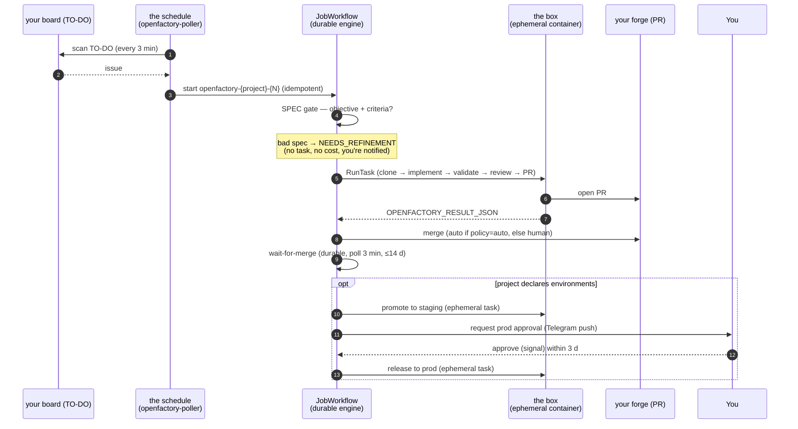

# The Autonomous Flow — end to end, with timings

**What this document is for:** a single, explainable reference for how a ticket goes
from *"a card on the board"* to *"merged (and optionally released)"* with **no manual
trigger and no IDE**. It covers every stage, every timing, the safety gates, the
resilience behaviour, and the cost — so the system can be explained to anyone.

The north star: **you write the specification, everything else runs itself.** A human
only acts at one point by design — approving a production release — and even that is
optional per project.

---

## 1. The one thing a human does

Put a well-specified issue in the board's **TO-DO** column. That's it.

A "well-specified" issue carries, in its body:

```
---
base_branch: main
---

## Objective
<one clear sentence: what and why>

## Acceptance Criteria
- <verifiable outcome 1>
- <verifiable outcome 2>
```

Everything below happens without anyone watching. The only later human touch is an
optional **production approval** (§5), and you are *notified* when it's needed — you
never have to poll or check.

---

## 2. The end-to-end flow



### Stage by stage

| # | Stage | State | Where it runs | What happens |
|---|---|---|---|---|
| 1 | **Pickup** | `todo` | Temporal Schedule | `openfactory-poller` scans each project's TO-DO column every **3 min**. Overlap **SKIP** (a tick never starts if the previous is still running). |
| 2 | **Spec gate** | `spec_validation` → `ready` / `needs_refinement` | Worker | Checks the issue has objective + acceptance criteria. **Fails → `needs_refinement`, no box launched, zero cost, you're notified.** This is the guard that keeps junk out. |
| 3 | **Job start** | — | the engine | Deterministic workflow id `openfactory-{project}-{issue}`. Starting the same issue twice is a **safe no-op** (idempotent). |
| 4 | **Clone** | `preparing` | the box | Ephemeral 2 vCPU / 4 GB ARM64 task starts, clones the repo into an isolated worktree sandbox. ~**<1 min**. |
| 5 | **Plan** | `planning` | the box | The **planner** (read-only) investigates the codebase and drafts a testable plan + a size estimate. **Task-sizing gate (ADR-0002):** a plan past the project's budget (`max_plan_files` / `max_plan_steps`), or the planner's own `SPLIT NEEDED` verdict, → `needs_refinement` **before the executor runs** — caught cheaply, on the read-only planner. |
| 6 | **Implement** | `implementing` | the box | The **executor** implements the plan with TDD in the sandbox. **~5 min** for a small ticket; more for larger work. Bounded by the turn cap (a runaway disjuntor, default 120) and the per-ticket cost ceiling (`max_cost_usd`). |
| 7 | **Validate** | `validating` | the box | Runs the project's own gates: `make lint` / `security` / `type` / `test`. Observed on a small ticket: **~15 s** for lint+security+type. |
| 8 | **Repair** | `repairing` | the box | If validation fails, a **bounded** repair loop (capped by `repair_max_attempts` and the `max_cost_usd` ceiling) — never infinite. Past the cost ceiling → `on_hold`. |
| 9 | **Review** | `reviewing` | the box | An automated review pass over the diff; its notes are posted to the PR. (This is a second agent pass, so it adds a few minutes.) |
| 10 | **PR** | `pr_open` | GitHub | Find-or-create the PR (idempotent — re-runs reuse the same PR). |
| 11 | **Merge** | `merged` | GitHub | `merge_policy: auto` → **merge on the current base** (ADR-0003): rebase onto the latest base first; if it moved, **re-run every gate** on the rebased result + re-push, then squash-merge. A textual conflict or a failed re-validation → `on_hold` for a human; it never crashes. Otherwise waits for a human merge. |
| 12 | **Wait-for-merge** | `ci_waiting` | Temporal | Durable poll of merge status every **3 min**, bounded by **`merge_deadline_days` = 14**. Not merged in time → `on_hold`. |
| 12b | **Knowledge refresh** | (no state — post-merge) | Worker | Only when the project sets `knowledge_map: true` (ADR-0017). Regenerates the module map from the base branch's new state and publishes one commit to the `openfactory-knowledge` branch. Bounded (**10 min**), single-attempt, result swallowed — a merged ticket is never held or failed by it. Writes nothing when no source changed. |
| 12c | **Deploy watch** | (no state — post-merge) | Worker | Only when the project declares `post_merge_deploy:`. Follows YOUR deploy workflow's run on the merge commit and reports success/failure/timeout. It never gates: the ticket is already done. |
| 13 | **Promote** | `staging_deploying` / `staging_verifying` | Worker | Only if the manifest declares `environments:`. **The platform does not deploy** — your pipeline does, with your secrets. Each stage of `promote:` before the last is OBSERVED: the deployment status of its `deploy_ref`, then a probe of its `health_url`. A stage with neither is passed through unchecked, and the ticket says which were really verified. |
| 14 | **Prod approval** | `awaiting_prod_approval` | Human | **The only mandatory human gate** (and only when prod is configured). You get a Telegram push; approve within **`approval_deadline_days` = 3**. |
| 15 | **Release prod** | `prod_releasing` / `prod_verifying` | Worker | On approval the platform creates the tag `<prod_tag_prefix><version>` on the base branch — your pipeline releases from it — and then observes production the same way as any other stage. |
| 16 | **Done** | `done` | — | Written by the promotion tail. **A project that declares no `environments:` reaches it at the merge instead** (step 11/12), with a ticket comment saying that nothing is watching a deploy and nobody will be asked to validate one — see [ONBOARDING §13](ONBOARDING.md). |

> **Small-ticket wall-clock (observed on a real ticket, #207):** pickup latency
> (≤3 min) + clone (~1 min) + implement (~5 min) + validate incl. tests+migrations
> (~2–4 min) + review pass (~5–10 min, it's a second agent pass) + PR + merge. Ballpark
> **~15–25 min** from card-in-TO-DO to merged, for a small change. The review pass is the
> biggest single chunk after implement. Larger tickets scale with implement/review time,
> not the plumbing.

---

## 3. Timing reference (every cadence, deadline and timeout)

| Parameter | Value | Meaning | Where |
|---|---|---|---|
| **Poll cadence** | **3 min** | How often the board is scanned for new TO-DO items | `openfactory-poller` schedule (`--every-minutes`) |
| Overlap policy | **SKIP** | A poll never overlaps a still-running poll | `schedule.py` |
| **Rate-limit backoff** | **30 min** | Wait between resume attempts when the agent hits the subscription usage limit | `_PAUSE_BACKOFF` |
| Max resume attempts | **48 (~24 h)** | After ~24 h still limited → `on_hold` (human) | `_MAX_PAUSE_RESUMES` |
| **Merge wait poll** | **3 min** | How often merge status is checked while waiting | `_MERGE_POLL` |
| **Merge deadline** | **14 days** | Max durable wait for the PR to merge → else `on_hold` | `merge_deadline_days` |
| **Prod approval deadline** | **3 days** | Window to approve a prod release | `approval_deadline_days` |
| Job activity timeout | **4 h** | Hard cap on a single job task | `start_to_close_timeout` |
| Job heartbeat timeout | **120 s** | Worker dead → Temporal re-runs the activity (self-heal) | `heartbeat_timeout` |
| Promotion activity timeout | **40 min** | Cap on a staging/prod deploy task | `start_to_close_timeout` |
| Validation timeout | **30 min** | Cap on the project's validate step | `_VALIDATION_TIMEOUT` |

All defaults; each is a one-line change.

---

## 4. Resilience — why nothing is lost

Every wait and every side-effect is designed so that a crash, a redeploy, or an expired
credential never loses work:

- **Durable timers.** Every "wait" (rate-limit backoff, merge wait, approval window) is a
  Temporal timer, not a running process. The worker can restart, be redeployed, or crash
  mid-wait — the job **resumes from the exact same point**. Nothing needs to stay open on
  your laptop.
- **Zero cost while waiting.** A paused/waiting job has **no box running** — it's
  just a timer. You pay nothing for a job that's blocked on a rate limit or an approval.
- **Idempotent side-effects.** Re-running an issue reuses the same workflow id, the same
  PR, the same tags (find-or-create + force-push + reconcile). Re-runs are safe by
  construction — no duplicate PRs, no double-releases.
- **Self-heal.** If the worker dies mid-job, the activity stops heart-beating; after
  120 s the engine re-schedules it and the launcher **re-attaches** to the running
  task (or relaunches). Verified live by killing the worker mid-job.
- **The spec gate.** Ill-specified issues stop at `needs_refinement` **before** any
  compute is spent — no task, no cost — and you're told why. (Seen live: several
  under-specified backlog items bounced harmlessly here, no PRs, no spend.)

---

## 5. What a human does — and when you're told

| Situation | Who acts | How you find out |
|---|---|---|
| Normal ticket, `merge_policy: auto` | **Nobody** — it merges itself | — |
| Prod release configured | **You approve** (once) | **Telegram push** when approval is needed |
| Spec too weak | You refine the issue | Notified: `needs_refinement` + reason |
| Rate-limited | **Nobody** — resumes in ≤30 min | (only notified if it exhausts ~24 h → `on_hold`) |
| Agent auth expired / real impediment | You rotate a secret / look | Notified: `on_hold` (loud) |

**The system notifies you; you never poll it.** The default posture is: you do nothing
unless a push tells you to.

---

## 6. Cost

**On your own machines the infrastructure cost is zero** — the worker, the boxes and the durable
engine are containers on hardware you already have. The only bill is the coding agent's, and on a
flat subscription that is a *quota*, not money:

| Item | Cost |
|---|---|
| Worker, boxes, engine, panel | **$0** — your own machine |
| Coding agent | **$0 per token** on a flat subscription; the constraint is usage *quota*, which self-pauses and resumes (§3). On a metered API key it is per token, and every pass is metered per ticket |

**If you add a cloud** — an add-on, never required — the shape above becomes a small always-on
task plus one ephemeral task per ticket. On the reference deployment that ships with the
`openfactory-aws` add-on package (its `infra/`, not a directory of this tree) that measured
**~$15/month fixed and ~1¢ per ticket**: the part that scales with volume is the cheap part, and
the fixed part is small. Those are one provider's prices in one region, quoted so the order of
magnitude is honest, not as a rate card.

---

## 7. Where to watch a job

1. **The panel** — the floor, the job's own pipeline, and everything that needs a human, in one
   place. This is the reference surface; the rest are for digging.
2. **The job's log** — the box's full output, with `OPENFACTORY_PHASE:` markers, the
   `OPENFACTORY_EVENT:` journal and a final `OPENFACTORY_RESULT_JSON:`. Locally the panel's **Logs**
   page reads it straight off disk; with a cloud it is wherever that cloud collects logs.
3. **The durable engine's own UI** → workflow `openfactory-{project}-{issue}`: every step, retry,
   timer and result.
4. **The issue / pull request**: the state comments and the review the bot posted.

What a human is asked for, and what to do about each, is
[`architecture.md`](architecture.md) §7. Incident response on the reference cloud deployment —
secret expiry, rollback, stop-all — is the `openfactory-aws` package's own `docs/runbook.md`.
