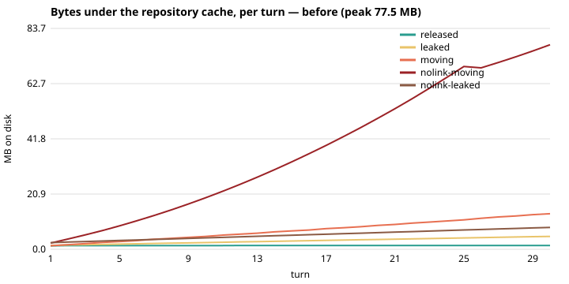
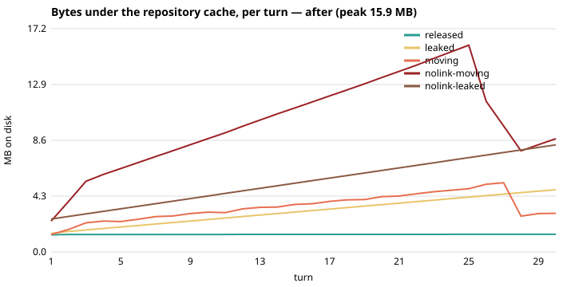
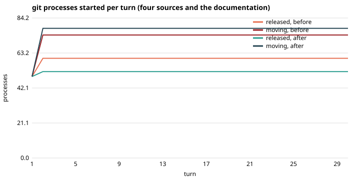

# What a turn of the product role leaves on the worker (#369)

Measured with [`tools/measure_a_turns_footprint.py`](../../../tools/measure_a_turns_footprint.py)
on the four-source fixture (`tests/fixtures/evaluation/harbourline`: one context repository, four
sources, 1.3 MB checked out), 30 turns per regime, on `main` at `4b5c335` (*before*) and on the
branch of this change (*after*). `before.json` and `after.json` hold every turn's numbers; the
charts are drawn from them with `--chart`.

    .venv/bin/python tools/measure_a_turns_footprint.py --turns 30 --tree <checkout> --json out.json
    .venv/bin/python tools/measure_a_turns_footprint.py --chart before.json after.json --into .

## Bytes under the repository cache, per turn

| regime | before: growth per turn | after 30 turns | after: growth per turn | after 30 turns |
|---|---:|---:|---:|---:|
| released — nothing moves, the view released | 5 KB | 1.44 MB | 1 KB | 1.36 MB |
| leaked — nothing moves, the view never released | 119 KB | 4.88 MB | 116 KB | 4.80 MB |
| moving — every source and the context move each turn | **418 KB** | **13.46 MB** | 56 KB | 2.97 MB |
| nolink-moving — the same, no hardlinks | **2,589 KB** | **77.46 MB** | 219 KB | 8.72 MB |
| nolink-leaked — never released, no hardlinks | 199 KB | 8.29 MB | 197 KB | 8.25 MB |

*moving* is the shape of a real deployment: the role writes to the context repository on every
turn it records something, and each source moves on its own. Before, every move parked a
snapshot for its thirty-minute grace — 195 parked trees after 40 turns, each pinning the index,
the refs and the packs of its generation; without hardlinks each was a whole copy of its master.
After, a key parks at most two.

*leaked* is the API paths (a queue proposal, a card written through the panel, the needs-action
review): the view they composed stayed until the two-hour sweep. The tool measures the module
directly, so the row is unchanged here; the activities now release their view (the guard is
`test_an_api_call_that_composes_a_view_of_the_product_releases_it`).

## git processes per turn, nothing moved

| | before | after |
|---|---:|---:|
| processes started, four sources and the documentation | 60 | 52 |
| of which round trips to a forge | 10 | 6 |
| per unmoved source: round trips | 2 (`ls-remote`, `fetch`) | 1 (`ls-remote`) |
| per unmoved source: passes over the tree | `ls-tree -r`, `sparse-checkout set`, `checkout -f -B`, `clean -fdx` | none |

At N sources the unmoved turn cost 2N round trips and N tree passes, eight at a time, before the
role said a word; it now costs N ref advertisements. The documentation checkout (`RepoCache`) still
fetches and resets on every turn — one key per product, not N — and is not changed here.
